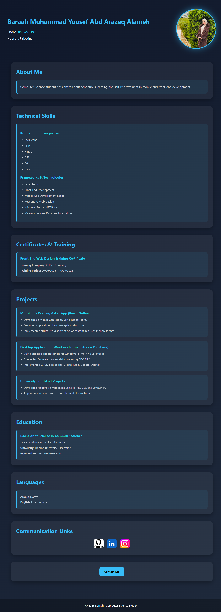

# 🌐 Personal Portfolio

Welcome to my personal portfolio website!

This project was built using **HTML5** and **CSS3** to showcase my background, technical skills, projects, education, and contact information through a clean, responsive, and modern interface.

---

## ✨ Features

- 📱 Fully responsive design
- 🎨 Modern and clean user interface
- 🏗️ Semantic HTML5 structure
- 🎯 Organized and maintainable CSS
- 👩‍💻 Personal profile section
- 💡 Technical skills showcase
- 📂 Projects section
- 🎓 Education & Certificates
- 🌍 Social media links
- 📧 Contact button

---

## 🛠️ Technologies Used

- HTML5
- CSS3
- Flexbox
- CSS Variables
- Media Queries

---

## 📷 Project Preview

> After uploading the screenshot to GitHub, replace this text with the image.



---

## 📁 Project Structure

```text
Portfolio/
│
├── images/
│   ├── Screenshot.png
│   ├── Baraah.jpeg
│   ├── git.png
│   ├── inst.jpg
│   └── link.jpg
│
├── index.html
├── style.css
└── README.md
```

---

## 🎯 Project Purpose

The goal of this project is to practice front-end web development fundamentals by creating a responsive personal portfolio that highlights my skills, education, and projects.

---

## 📱 Responsive Design

The website is fully responsive and adapts to different screen sizes, including desktops, tablets, and mobile devices.

---

## 🚀 Future Improvements

- Add JavaScript interactions
- Improve animations and transitions
- Add Dark/Light Mode
- Deploy the project using GitHub Pages
- Expand the projects section

---

## 📬 Contact

- **Email:** baraah.alameh2005@gmail.com
- **GitHub:** https://github.com/baraahalameh2005-prog
- **LinkedIn:** https://www.linkedin.com/in/baraah-youssef-459262411/

---

## 👩‍💻 Author

**Baraah Alameh**

Computer Science Student passionate about Front-End Development and Mobile Application Development.